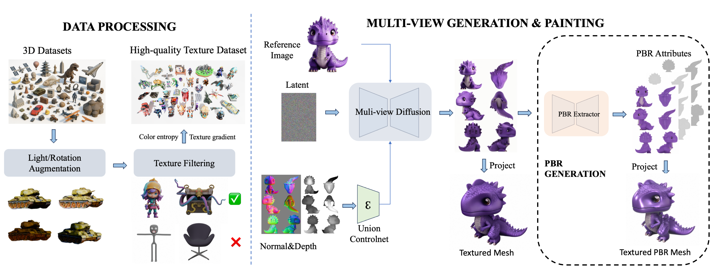

# MVPainter
<div align="center">
 <a href='https://huggingface.co/shaomq/MVPainter'></a> &nbsp;
 <a href='https://github.com/amap-cvlab/MV-Painter'></a> &nbsp;

</div>
MVPainter is a fully open-source system for 3D texture generation, providing a comprehensive solution including data, models, and evaluation tools.




- [ ] Release technical report.
- [ ] Release gradio demo.
- [x] Release training code.
- [x] Release data processing code.

## ✨Key Features
* 🔓 Fully Open-Source Texture Generation Pipeline

* 🧩 Compatible with Mainstream 3D Geometry Generation Methods

* 🎨 High-Fidelity, Geometry- and Image-Aligned PBR Texture Generation


## 🔥 News

* [2025-04-30] Release model weights, data processing, trainning, inference scripts.

## 🔧[Installation](./MVPainter/INSTALL.md)

## 💡Infererence
### Generate multi-view images

1. Prepare the input images and glbs in `/data/test/imgs` and `/data/test/glbs`.

2. Run the following command to infer:
    ```
    python infer_multiview.py --input_glb_dir ./data/test/glbs --input_img_dir ./data/test/imgs --output_dir ./outputs/test --geo_rotation 0
    ```


    Mesh generated from [TripoSG](https://github.com/VAST-AI-Research/TripoSG), use `--geo_rotation 0`

    Mesh generated from [Hunyuan-2](https://github.com/Tencent/Hunyuan3D-2), use `--geo_rotation -90`

    Mesh generated from [TRELLIS](https://github.com/microsoft/TRELLIS)，use  `--geo_rotation -90`

    Mesh generated from [Hi3dGen](https://github.com/Stable-X/Hi3DGen)  `--geo_rotation -90`


### Extract PBR (Optional)
Extract PBR attributes from generated mul-view images.

```
python infer_pbr.py --mv_res_dir ./outputs/test
```

The extracted PBR maps will be saved in `--mv_res_dir` directory.


### Painting

Run the following command to paint 3d model with multi-view generations:

```
python infer_paint.py --mv_res_dir ./outputs/test/mvpainter --output_dir ./results/test/mvpainter --geo_rotation 0
```

`--mv_res_dir` is the directory of the generated multi-view images.


## 🏋️Training
### Multi-View Generation Model
#### Train UNet
```
python train.py --base=./configs/mvpainter-train-unet.yaml --gpus 0 --num_nodes 32 --logdir=./logs
```

#### Train controlnet
```
python train.py --base=./configs/mvpainter-train-controlnet.yaml --gpus 0 --num_nodes 32 --logdir=./logs
```

### PBR Model
Our pbr model is improved based on [IDArb](https://github.com/Lizb6626/IDArb). The specific improvements can be found in our technical report. Our training script is similar to IDArb:

```
accelerate launch --config_file configs/acc/8gpu.yaml train_pbr.py --config configs/train.yaml

```
## [Data Processing](./data_process/README.md)

## 📝[Evaluation](./MVPainter/evaluation/README.md)


## ⭐️Acknowledgment

In this project we use parts of the implementations of the following works:
- [Hunyuan3D-1](https://github.com/Tencent/Hunyuan3D-1)
- [Hunyuan3D-2](https://github.com/Tencent/Hunyuan3D-2)
- [IDArb](https://github.com/Lizb6626/IDArb)
- [MaterialAnything](https://github.com/3DTopia/MaterialAnything)


We thank these work's contributors for open sourcing their research and exploration.